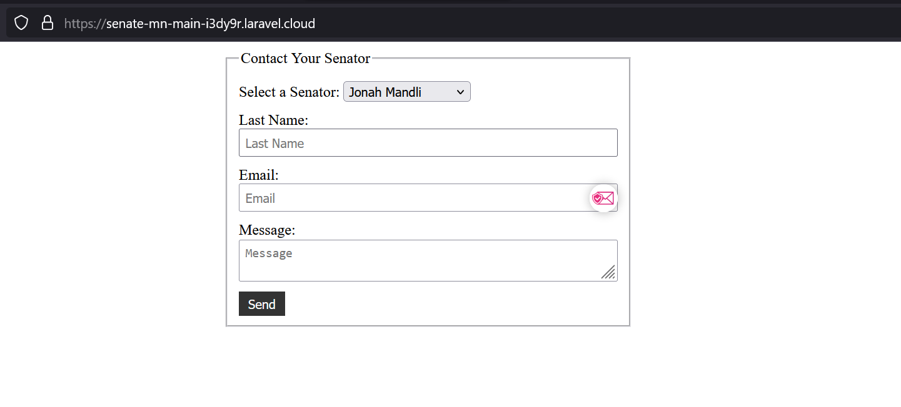

# Project Summary

This project serves a simple web form for contacting your local senator. I've hosted this via Laravel Cloud's free tier and this can be seen live here: https://senate-mn-main-i3dy9r.laravel.cloud/




Submitting this form will queue an email to be sent via the configured laravel driver. As this is just for demonstration purposes, sent emails will only log to our laravel.log file. 

Note that there is a field to select which senator you'd like to send an email to, this will be explained below.


# Database 
The database contains one table called `senators` can be seeded with 

```
php artisan db:seed
```

This command will create four senator records in a sqlite database.

> I've added the sqlite database in version control as it wasn't obvious how they wanted you to use SQLite with Laravel Cloud

We can leverage these records when building our form to populate a dropdown with valid senators. 

# API

We're using a single action controller called ContactSenatorController. The handler within this controller leverages a FormRequest called ContactSenatorRequest to handle validation of our web request.

Fields that do not pass validation will generate errors that are rendered above the form.

Upon validating the four fields required to send the email, we build a Mailable object called SenatorContacted and queue it to be dispatched via the configuired queue driver.

Once processed, the mailable will build out the email via a template in `views/emails` called `senator-contacted.php`. All the data from the request will be available in this blade template and populated as needed.

The user will then be displayed with a success message when redirected back to the form.

# Security

Laravel ships with a lot of security features already, but one thing to note was that the @csrf directive was added to ensure safety against Cross Site Request Forgery exploits.

# Notes

There are likely some items that were missed here. If needed, I can take another pass at this over the weekend. Namely, logging and confirmation that emails are actually sending outside of just viewing the log files. Let me know if this is necessary for completion of the assessment.